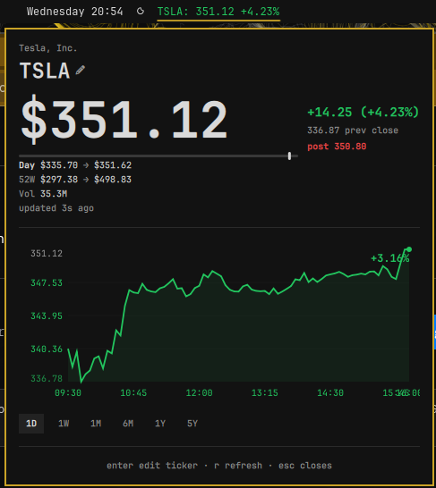
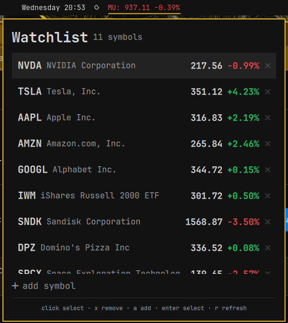

# Stock Ticker

Real-time stock price ticker with an interactive line chart for the Omarchy Quattro bar.

## Screenshots

| Details panel | Watchlist |
| --- | --- |
|  |  |

## Install

```sh
omarchy plugin add https://github.com/dchristensen8/omarchy-stock-ticker.git --enable
```

## Usage

### Bar label

Shows the ticker (uppercase), the latest price, and the day's percent change, e.g. `MU: 937.85 -7.3%`. The label color follows the day's move: green when up, red when down, dimmed when the data is stale (no successful fetch within three refresh cycles).

Click the label to open the details panel; **right-click** opens the watchlist; middle-click refreshes immediately.

### Watchlist

Right-click the bar label to open the shared watchlist pane. It shows every
symbol you're tracking with a live mini-quote (price + day's change, color-coded
the same as the bar label).

- Click a row to switch the widget to that ticker (closes the watchlist pane)
- Hover a row to pre-highlight it, then `Enter` to select
- `↑` / `↓` (or `k` / `j`) to move the selection
- `x` or the red ✕ to remove a symbol
- `a` or the "+ add symbol" row to add one; additions are validated against
  Yahoo before they are saved (typos are rejected with "Ticker not found")

The watchlist is stored in `~/.local/share/stock-ticker/watchlist.json`
(symbols plus a cache of the last-known mini-quotes, so the pane isn't blank on
first open). The file is shared by all instances of the widget, and writes are
merged against the latest on-disk state. Mini-quotes refresh sequentially —
one request at a time, every 45 seconds — only while the watchlist pane is
open, so a large list can't hammer the API or interfere with the primary
ticker's own retry/backoff behavior.

### Details panel

- Company name, ticker (editable — see below), price with currency
- Day's change ($ and %), previous close, currency
- Range bar marker showing where the price sits within the **chart's selected timeframe** (true intraday range on 1D, the plotted high–low otherwise), plus the day low → high and 52-week low → high reference rows
- After-hours / pre-market price in the stats column with the time of the last print (e.g. `post 310.22 · 19:58`), colored by the change vs the regular close; stays available after the close and through the overnight gap via the prior session's final print; the bar's main price stays on the regular close
- Volume (abbreviated: `12.4M`, `340K`)
- "Updated Xs ago" freshness line (amber when stale)
- Interactive line chart with a hover crosshair showing `price · time`
- Timeframe selector: 1D, 1W, 1M, 6M, 1Y, 5Y
- "Ticker not found" feedback when a symbol does not exist

### Keyboard

| Key | Action |
| --- | --- |
| `Enter` | Edit ticker symbol (quote pane) / select highlighted row (watchlist pane) |
| `←` / `→` (or `h` / `l`) | Step through timeframes |
| `↑` / `↓` (or `k` / `j`) | Move watchlist selection |
| `x` | Remove the selected watchlist row |
| `a` | Add a symbol (watchlist pane) |
| `r` | Refresh now |
| `Esc` | Close the panel |
| `Tab` / `Shift+Tab` | Switch to the neighboring panel |

### Refresh behavior

- The plugin refreshes automatically **once per minute** while the NYSE is open
  (9:30–16:00 ET, Mon–Fri) and **once every 3 minutes** while it's closed, so the
  after-hours/pre-market price keeps tracking without hammering the API.
- A **manual refresh overrides** the schedule and fetches immediately:
  middle-click the bar label, or press `r` in the panel.
- On consecutive fetch failures the interval backs off exponentially (up to 8×),
  and resets after a successful fetch.
- An invalid ticker stops automatic retries until you edit the symbol.

## Multiple tickers

The plugin supports multiple instances (`allowMultiple: true`). Add more than one entry to the bar layout, each with its own `ticker`. All instances share one watchlist (see above), so "stocks I'm tracking" lives in one place regardless of how many widgets are on the bar:

```json
{
  "id": "dchristensen8.stock-ticker",
  "ticker": "MSFT"
},
{
  "id": "dchristensen8.stock-ticker",
  "ticker": "AAPL"
}
```

## Configure

Change the tracked stock in `~/.config/omarchy/shell.json`:

```json
{"id": "dchristensen8.stock-ticker", "ticker": "MSFT"}
```

Or click the ticker name in the panel and press `Enter` to edit it interactively.

### Settings

| Key | Type | Default | Description |
| --- | --- | --- | --- |
| `ticker` | string | `AAPL` | Stock symbol, e.g. `AAPL`, `MSFT`, `GOOGL` |

## Tests

Pure helpers in `Model.js` are covered by Node's test runner:

```sh
node --test tests/model.test.js
```

## Notes

- This plugin uses an **unofficial/undocumented Yahoo endpoint** — not a
  supported API — and may break at any time. It may also be rate-limited. The
  plugin is intentionally conservative (1 min during market hours, 3 min
  otherwise); with multiple instances the default `allowMultiple` means
  several widgets can still be polling at once.
- Ticker input is validated against an allowlist (`A–Z`, `0–9`, and `.`/`-`/`^`/`=`,
  up to 10 chars) before any request is made, and the watchlist is capped at 50
  symbols so a hand-edited file can't balloon the UI or the fetch queue.

## Remove

```sh
omarchy plugin remove dchristensen8.stock-ticker
```

## Dependencies

- `curl` (for Yahoo Finance API requests)
- Internet connection (for live price data)

## License

MIT